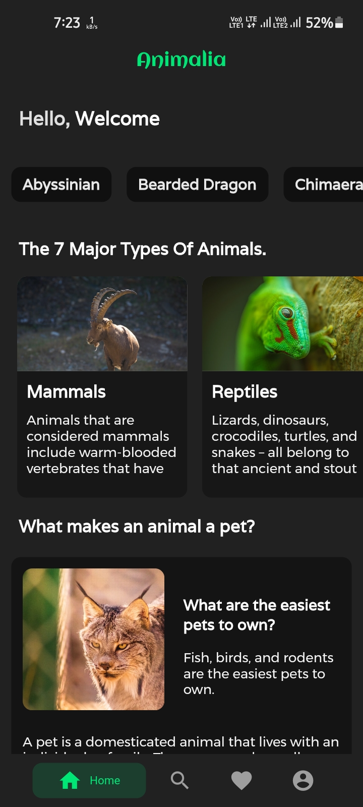
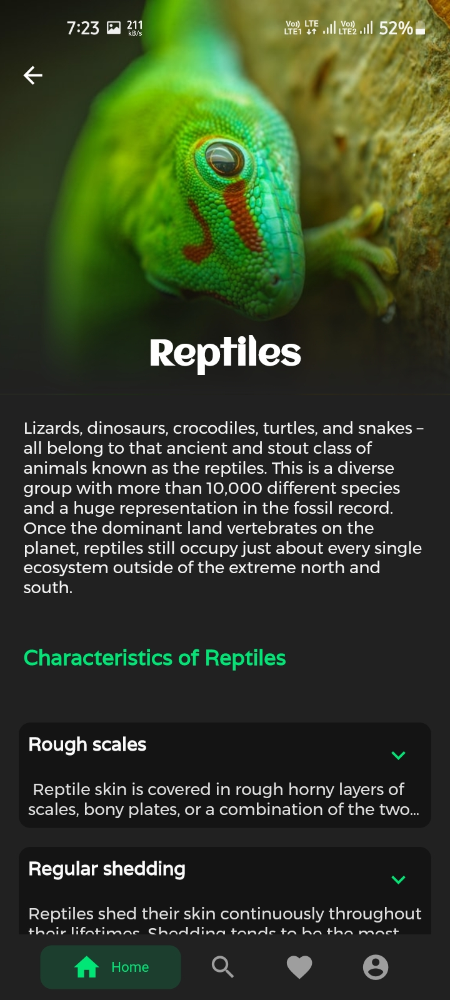
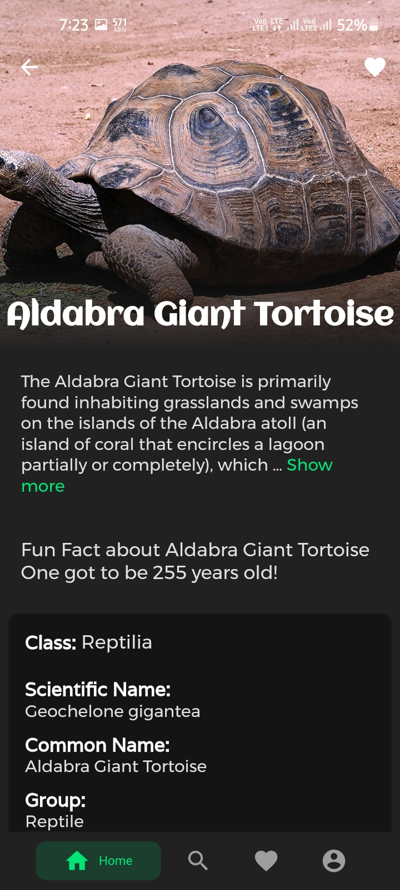
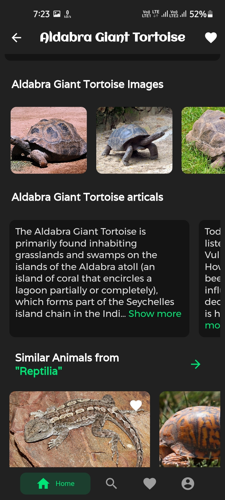
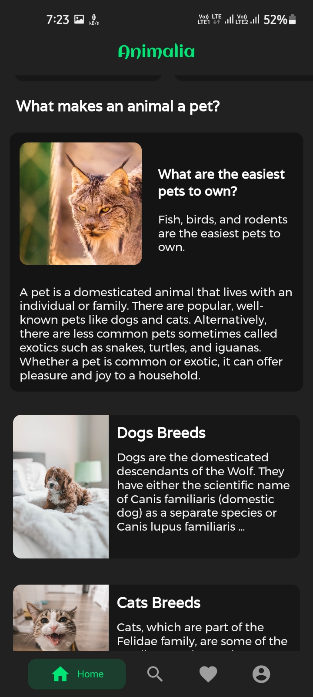
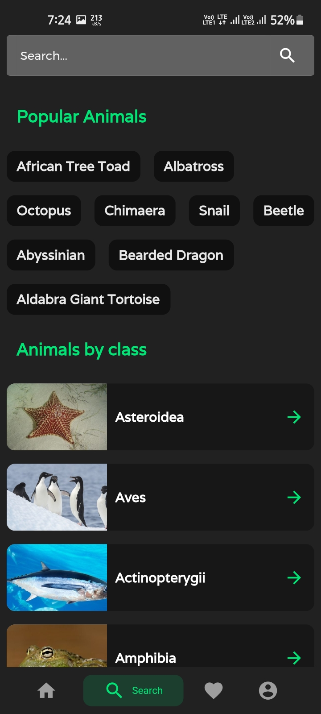
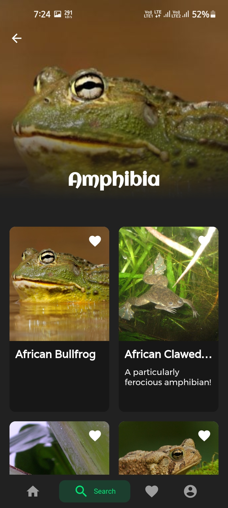
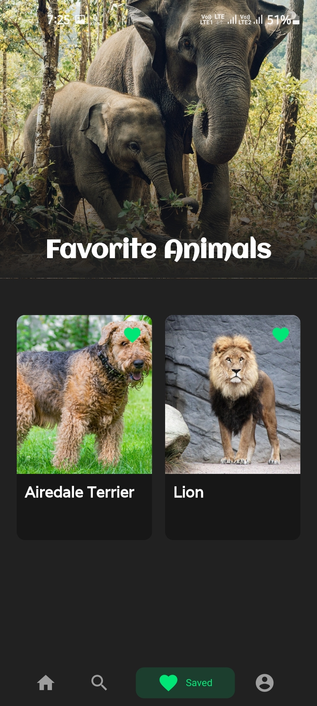

# Animalia

A new Flutter project.

- If you want cute animals, wild animals, weird animals or are looking for comprehensive pet guides for dogs and cats, we’ve got you covered!
- Animalia app contains full information about all living beings on planet earth.
- Animals form the largest of the natural world's five kingdoms, with nearly 2 million different animal species having been recorded and new animals are still constantly being discovered.
- app includes all Types of animals information and large collections of images.
- All animals and data came from [A-Z animals site](https://a-z-animals.com/)
- people know more about the world’s creatures they will better care for them.

</br>
</br>


## Screenshots

<br>
<p align="center">









</p>

## How to use

To clone and run this application, you'll need [Git](https://git-scm.com/downloads) and [Flutter](https://flutter.dev/docs/get-started/install) installed on your computer. From your command line:

### Clone this repository

```
git clone https://github.com/risfat/Flutter-bloc-Animalia
```

### Go into the repository

```
cd Flutter-bloc-Animalia
```

### Install dependencies

```
flutter packages get
```

### Run the app

```
flutter run
```
